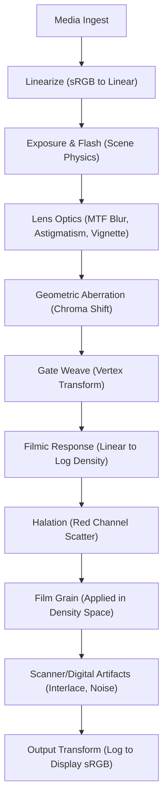

# Disposable Night — Simulation Engine Roadmap (Technical Spec v2.0)

**Audience:** Core Engineering
**Status:** Phase 1 (Foundation) Complete. Phase 2 (Simulation) Starting.
**Purpose:** A definitive, build-ready plan to evolve the app from "aesthetic filters" to a **physically-motivated light simulation engine**.
**Scope:** New modules, rigorous color science refactoring, temporal state management, new pipeline order, export parity, and delivery plan.

---

## 0) Design Principles & Constraints

*   **The Path of Light.** We do not apply "effects." We simulate the physical journey of photons: `Scene Linear Light` → `Plastic Lens` → `Chemical Emulsion` → `Development (Density)` → `Scanner/Sensor` → `Digital Codec`.
*   **Strict Color Discipline.**
    *   **Linear Space:** All physical light interactions (Exposure, Flash, Bloom, Lens Blur) must happen on linear RGB values.
    *   **Log/Density Space:** Film response and grain application happen in Log space.
    *   **Display Space:** Only convert to sRGB/Gamma 2.2 at the very last step (or for UI preview).
*   **Temporal Continuity.** Effects must not jitter randomly per frame. They must drift organically using 1D noise or PID controllers (e.g., Auto-Exposure hunting, Gate Weave).
*   **Parity.** The headless Electron export must render bit-identical to the on-screen "Native Output Preview."
*   **Determinism.** All randomness is seeded. Frame 100 must look identical every time it is rendered.

---

## 1) Current Baseline (Reference)

*   **ExposureFlashModule** (Linear EV & Flash) — *Keep, but enforce linear input.*
*   **ToneModule** (S-Curve) — **DEPRECATE.** Replace with `FilmicResponse`.
*   **SplitCastModule** (Tint) — *Keep, move to Print/Display stage.*
*   **BloomVignetteOptics** — **REFACTOR.** Split "Lens Blur" (Optics) from "Bloom" (Glow). Vignette goes to Optics.
*   **MotionBlurModule** — *Keep.*
*   **HandheldCameraModule** — **REFACTOR.** Move state logic to `TemporalController`.
*   **FilmGrainModule** — *Keep*, but ensure it applies in Log/Density space for accurate shadow response.

---

## 2) Target Pipeline (The "Physics" Order)

This pipeline respects the physical order of operations. Light hits the lens before it hits the film.



**Notes:**
*   **Gate Weave** shifts the image plane *before* sampling, simulating the film strip moving relative to the aperture.
*   **Lens Optics** (Blur) must happen *before* Grain. You can have a blurry image with sharp grain (authentic). You cannot have blurry grain (fake).

---

## 3) Priority Plan Overview

| Priority | Module | Type | Goal |
| :--- | :--- | :--- | :--- |
| **P0** | **Color Space Refactor** | Core | Rename all shader inputs (`uTexLin`, `uTexLog`) to prevent math errors. |
| **P0** | **FilmicResponse** (Repl. Tone) | Chemistry | H-Curve simulation with toe/shoulder and color crossover. |
| **P0** | **LensOptics** | Optics | Radial MTF softness (center sharp, corners soft). |
| **P0** | **TemporalController** | Core (CPU) | Managing state drift (Exposure hunting, Weave). |
| **P0** | **CodecArtifacts** | Digital | YUV 4:1:1 subsampling and macroblocking. |
| **P1** | **Halation (Physically Based)** | Chemistry | Red-channel specific scatter based on emulsion thickness. |
| **P1** | **Gate Weave** | Mechanics | Sub-pixel vertex shifting. |
| **P1** | **CCD Smear & Sensor Noise** | Digital | Vertical highlight streaks and additive shadow noise. |
| **P2** | **InstantFilm Frame** | Polish | Border texture and chemical development spread. |
| **P2** | **DateStamp** | Polish | 7-segment display overlay with bloom. |

---

## 4) Detailed Specifications

### 4.1 FilmicResponseModule (The "H-Curve")
**Objective:** Replace the generic "S-Curve" with a parametric curve that simulates the density response of negative film.

*   **Inputs:** `uTexLin` (Linear RGB).
*   **Uniforms:**
    *   `uToe`: Controls the shadow compression region.
    *   `uGamma`: The straight-line slope (contrast) in Log space.
    *   `uShoulder`: The highlight rolloff (soft clip).
    *   `uWhitePoint`: The linear value that maps to 1.0 density.
    *   `uCrossover`: `vec3` offset applied to the shoulder start point per channel.
*   **Algorithm:**
    *   Convert Linear RGB to Log2.
    *   Apply parametric curve:
        *   If `x < Toe`: Exponential ramp.
        *   If `Toe < x < Shoulder`: Linear slope `y = gamma * x + b`.
        *   If `x > Shoulder`: Asymptotic decay toward max density.
    *   *Crossover Logic:* `shoulder_limit_r = base_shoulder + uCrossover.r`. This causes highlights to shift color (e.g., creamy yellow or cyan sun) before blowing out.
*   **Outputs:** `uTexLog` (Normalized Density 0.0-1.0).
*   **Parameters:**
    *   `toe`: [0.0 - 0.4]
    *   `gamma`: [0.8 - 1.6]
    *   `shoulder`: [0.6 - 1.0]
    *   `crossover`: [±0.1]

### 4.2 LensOpticsModule (MTF & Astigmatism)
**Objective:** Simulate the poor resolving power of cheap plastic lenses ($5 disposable camera lenses).

*   **Inputs:** `uTexLin`.
*   **Uniforms:** `uCenterSharpness`, `uEdgeBlurRadius`, `uAstigmatism`.
*   **Algorithm:**
    1.  Compute normalized radial distance `d` from center `(0.5, 0.5)`.
    2.  `blur_radius = mix(0.0, uEdgeBlurRadius, pow(d, 2.5))`.
    3.  **Gaussian Pass:** Perform a 9-tap or 13-tap blur using `blur_radius`.
    4.  **Astigmatism (Optional):** Instead of a circular kernel, stretch the kernel tangentially to the radius vector (creates "swirly" bokeh at edges).
*   **Outputs:** `uTexLin` (Blurred).
*   **Parameters:**
    *   `edgeBlur`: [0.0 - 4.0] (Pixels)
    *   `falloff`: [1.5 - 4.0] (Power)

### 4.3 TemporalController (CPU State Manager)
**Objective:** Manage values that drift over time. Replaces random per-frame jitter.

*   **State:**
    *   `time`: Accumulates `dt`.
    *   `noiseGenerator`: 1D Simplex/Perlin instance.
    *   `exposureState`: `{ currentBias, targetBias, velocity }`.
*   **Logic (Tick):**
    *   **Auto-Exposure Hunting:**
        *   Read current frame average luma (from 1x1 mipmap download).
        *   Calculate `targetEV` to center histogram.
        *   Update `currentEV` using a spring simulation (under-damped) so it overshoots and settles.
    *   **Gate Weave:**
        *   `weaveX = noise(time * 0.5) * amp`.
        *   `weaveY = noise(time * 0.4 + 100) * amp`.
    *   **White Balance Drift:**
        *   Slow sine wave oscillation on Tint/Temp.
*   **Outputs:** Defines the uniforms `uEVBias`, `uWeaveOffset`, `uWBTint` for other modules.

### 4.4 CodecArtifactsModule (The "MiniDV" Look)
**Objective:** Simulate digital compression damage.

*   **Inputs:** `uTexSRGB` (Display ready).
*   **Algorithm:**
    1.  **RGB to YCbCr conversion.**
    2.  **Chroma Subsampling:**
        *   Write `Y` to full-res buffer.
        *   Write `CbCr` to `Width/4` buffer (4:1:1 NTSC DV) or `Width/2` (4:2:2).
        *   Upscale `CbCr` back to full size using `GL_NEAREST` (hard edges) or `GL_LINEAR` (smear).
    3.  **Macroblocking:**
        *   Snap UV coords to 8x8 grid: `blockUV = floor(uv * blocks) / blocks`.
        *   Mix original pixel with blocked pixel based on `uBitrate`.
    4.  **Mosquito Noise:**
        *   Detect edges (Sobel).
        *   Add high-frequency noise *only* near edges.
    5.  **YCbCr to RGB conversion.**
*   **Parameters:**
    *   `subsampling`: [None, 4:2:2, 4:2:0, 4:1:1]
    *   `compression`: [0.0 - 1.0]
    *   `mosquito`: [0.0 - 0.5]

### 4.5 Halation (Physically Accurate)
**Objective:** Red light scattering through the film base.

*   **Inputs:** `uTexLog` (Density).
*   **Algorithm:**
    1.  **Threshold:** Isolate `Red` channel where `brightness > uThreshold`.
    2.  **Scatter:** Apply broad Gaussian blur (sigma ~20px) to this isolated Red channel.
    3.  **Masking:** Sample the `Cyan` layer (Red's complement). If the film is dense (dark), halation is blocked. If thin (bright/transparent), halation passes.
    4.  **Composite:** Add the blurred red glow back onto the original image.
*   **Parameters:**
    *   `threshold`: [0.7 - 1.0]
    *   `radius`: [0.0 - 50.0]
    *   `intensity`: [0.0 - 1.0]

### 4.6 Gate Weave (Mechanical)
**Objective:** Film strip vibrating in the gate.

*   **Inputs:** Vertex Shader Uniform `uWeaveOffset` (from TemporalController).
*   **Algorithm:**
    *   In Vertex Shader: `gl_Position = vec4(a_pos + uWeaveOffset, 0.0, 1.0);`
    *   *Note:* This moves the image content relative to the viewport border. If we add an "Overscan" border later, this allows the black edge to wiggle visible.
*   **Parameters:**
    *   `amplitude`: [0.0 - 0.005] (Screen space)
    *   `frequency`: [0.0 - 10.0] (Hz)

---

## 5) API & Wiring (App Structure)

### 5.1 Updated Module Interface
We need to be explicit about color space requirements.

```javascript
class ModuleX {
  constructor(gl, quad) { ... }
  
  // Define requirements for pipeline validation
  get inputSpace() { return 'linear'; } // or 'log', 'srgb'
  get outputSpace() { return 'linear'; }

  apply(inputTex, outputFB, params, ctx) {
    // ctx now includes:
    // - time, dt
    // - temporal: { evBias, weave, wb }
    // - resolution info
  }
}
```

### 5.2 Preset Schema (JSON)
Presets now define the *mode* (Analog vs Digital) which alters the pipeline.

```json
{
  "id": "kodak_gold_2003",
  "label": "Summer 2003 (Disposable)",
  "pipeline_mode": "analog", 
  "params": {
    "Exposure": { "ev": 0.0 },
    "LensOptics": { "edgeBlur": 1.5, "falloff": 2.2 },
    "FilmicResponse": { 
      "toe": 0.15, 
      "gamma": 1.1, 
      "crossover": [0.02, 0.0, -0.01] 
    },
    "Temporal": { "weaveAmp": 0.001 },
    "Grain": { "iso": 400, "chroma": 0.5 },
    "Output": { "fps": 24 }
  }
}
```

```json
{
  "id": "digicam_2007",
  "label": "MySpace Cam (2007)",
  "pipeline_mode": "digital_ccd",
  "params": {
    "Exposure": { "flash_falloff": 8.0 },
    "LensOptics": { "edgeBlur": 0.2 },
    "FilmicResponse": { "gamma": 1.0, "toe": 0.0 }, 
    "CCDSmear": { "threshold": 0.9, "length": 0.5 },
    "CodecArtifacts": { "subsampling": "4:2:0", "compression": 0.6 }
  }
}
```

---

## 6) Implementation Notes

*   **Shaders:** Use `#define` guards for Color Space conversions in common headers.
    ```glsl
    // common.glsl
    vec3 linToLog(vec3 c) { ... }
    vec3 logToLin(vec3 c) { ... }
    vec3 linToSRGB(vec3 c) { ... }
    ```
*   **Framebuffers:**
    *   Keep `rtA`/`rtB` for the main chain.
    *   Add `rtChroma` (Quarter res) for Codec artifacts.
    *   Reuse Bloom buffers (`rtH`, `rtQ`) for Halation generation to save VRAM.
*   **Performance Budget:**
    *   Lens Blur is expensive (large kernel). Optimization: Only run high-quality blur on `rtA`. If fps < 30, degrade to a lower tap count or simple vignette blur.
*   **Export:**
    *   The `TemporalController` must support a `seek(time)` method or be deterministically stepped (`seed + frameIndex`) so that exports don't jump around differently than the preview.

---

## 7) QA / Bench Tests

### 7.1 Visual Unit Tests
*   **Filmic Ramp:** Input a horizontal 0-1 gradient. Output must be a smooth curve. If `Crossover` is enabled, the white end must show a tint.
*   **Lens Blur:** Input a grid pattern. Center grid lines should be sharp (1px). Corner grid lines should be blurred (~3px).
*   **Codec:** Input red text on black background. Enable `4:1:1`. The red should bleed horizontally by 4 pixels.

### 7.2 Golden Master Tests
*   Render "Frame 50" of "Big Buck Bunny" with the "Kodak Gold" preset.
*   Store the `Uint8Array` hash.
*   Any change to math/shaders must verify this hash or prompt a manual review of the visual change.

---

## 8) Developer Tasks & Milestones

### Milestone A (P0: The Physics Core)
1.  **Refactor:** Rename all shader uniforms in existing modules (`uTex` -> `uTexLin`). Ensure `Exposure` output is Linear.
2.  **New Module:** `LensOpticsModule`. Implement radial blur shader.
3.  **New Module:** `FilmicResponseModule`. Implement H-Curve math. Wire up UI sliders.
4.  **Cleanup:** Remove `ToneModule`.

### Milestone B (P1: Temporal & Digital)
5.  **Architecture:** Create `TemporalController.js`. Hook it up to `Exposure` (Bias) and `Handheld` (Transform).
6.  **New Module:** `CodecArtifacts`. Implement YUV subsampling FBOs.
7.  **Refactor:** Update `renderer-export.js` to use the new `TemporalController` with deterministic seeding.

### Milestone C (P2: Polish)
8.  **New Module:** `Halation`. Red-channel scatter.
9.  **Preset System:** Build the JSON loader/saver and the UI dropdown.
10. **Output:** Add "Date Stamp" overlay logic (simple atlas rendering).

---

## 9) File/Code Skeletons (Drop-in)

**`web/modules/filmic-response.js`**
```javascript
export const FILMIC_PARAMS = {
  toe: { min: 0, max: 0.5, step: 0.01, default: 0.2, label: 'Toe (Shadows)' },
  gamma: { min: 0.8, max: 1.8, step: 0.01, default: 1.1, label: 'Contrast' },
  shoulder: { min: 0.5, max: 1.0, step: 0.01, default: 0.8, label: 'Shoulder' },
  whitePoint: { min: 1.0, max: 4.0, step: 0.1, default: 2.0, label: 'Dynamic Range' },
  crossover: { min: -0.1, max: 0.1, step: 0.01, default: 0.0, label: 'Chem Crossover' }
};

const FRAGMENT_SHADER = `
precision highp float;
varying vec2 v_uv;
uniform sampler2D uTexLin;
uniform float uToe, uGamma, uShoulder, uWhitePoint, uCrossover;

// ... Helper log/lin functions ...

void main() {
  vec3 col = texture2D(uTexLin, v_uv).rgb;
  
  // Apply crossover to linear data before compression
  // e.g. Red saturates earlier (warmer highlights)
  vec3 whitePts = vec3(uWhitePoint) + vec3(uCrossover, 0.0, -uCrossover);
  
  // Normalize to white point
  col = col / whitePts;

  // Apply H-Curve (Simplified Reinhard-ish for placeholder)
  vec3 x = col;
  // Toe/Shoulder logic goes here...
  
  gl_FragColor = vec4(col, 1.0); // Output is now in Log space
}
`;
```

**`web/controllers/temporal-controller.js`**
```javascript
import { SimplexNoise } from '../utils/noise.js'; // Assume utility exists

export class TemporalController {
  constructor(seed = 0) {
    this.noise = new SimplexNoise(seed);
    this.time = 0;
    this.params = {
      exposureHunting: 0.0, // 0 to 1
      gateWeave: 0.0        // 0 to 1
    };
  }
  
  update(dt, sceneLuma) {
    this.time += dt;
    
    // Calculate Exposure Bias (Hunting)
    // If sceneLuma changed rapidly, targetEV shifts, currentEV lags behind.
    // ... PID logic ...
    
    // Calculate Weave
    const weaveFreq = 2.0;
    this.weaveX = this.noise.noise2D(this.time * weaveFreq, 0) * this.params.gateWeave * 0.005;
    this.weaveY = this.noise.noise2D(this.time * weaveFreq, 100) * this.params.gateWeave * 0.005;
  }
  
  getUniforms() {
    return {
      uTempExposure: this.exposureBias,
      uWeaveOffset: [this.weaveX, this.weaveY]
    };
  }
}
```

---

## 10) Risks & Mitigations

*   **Risk:** **Texture Banding.** Heavy processing in Log space on 8-bit textures can cause banding.
    *   **Mitigation:** We are already using `HALF_FLOAT` (Float16) textures in `gl-context.js`. Verify this is active on all targets. If mobile falls back to `UNSIGNED_BYTE`, add dithering at the end of `FilmicResponse`.
*   **Risk:** **Pipeline Complexity.** 10+ passes might kill the frame rate on integrated GPUs.
    *   **Mitigation:** Add a "Quality" toggle in UI. "High" = full separable blurs. "Low" = single pass approximate blurs.
*   **Risk:** **Export Divergence.** JS floats vs GPU floats.
    *   **Mitigation:** The visual tests (7.1) are crucial. If `CodecArtifacts` looks different on Export, check if the `OutputFormat` module handles resizing differently in the headless window.

---

### Final Note

Ship **P0** first. The moment you replace the S-Curve with the **H-Curve** (`FilmicResponse`) and add **Lens Softness** (`LensOptics`), the "video filter" look disappears. It stops looking like an overlay and starts looking like a recording.
